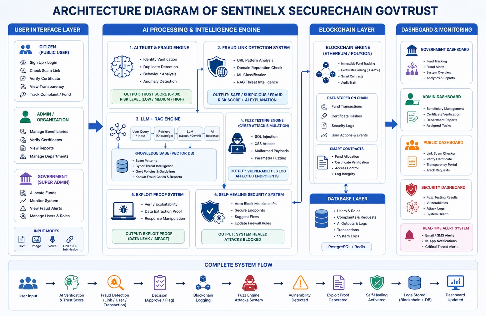

# 🚀 SentinelX SecureChain GovTrust  

---

---

## 🌍 Overview

**SentinelX SecureChain GovTrust** is an advanced AI-powered cybersecurity and governance platform that ensures:

- 🔐 Secure fund distribution  
- 🤖 Real-time fraud detection  
- 🔍 Scam & phishing detection  
- 🛡 Autonomous cyber defense  
- 🔗 Blockchain transparency  

---

## 🎬 Demo Preview

### 🖥 Dashboard

### 🔍 Fraud Detection

### 🛡 Cyber Defense

---

## 🧠 Core Features

- ✅ AI Fraud Detection Engine  
- ✅ Link Scam Detection System  
- ✅ RAG-based Threat Intelligence  
- ✅ Self-Healing Security  
- ✅ Blockchain Logging  
- ✅ Explainable AI  

---

## 🏗 System Architecture

Government / Admin / Citizen
        │
        ▼
Frontend Web Application
        │
        ▼
Backend API (FastAPI)
        │
        ├── Beneficiary Verification Engine
        ├── Fraud Detection Engine
        ├── Link Scam Detection System
        ├── Fuzz Testing Engine
        ├── Self-Healing Security Module
        ├── Blockchain Integration
        │
        ▼
Database + Blockchain Ledger
        │
        ▼
Transparency & Monitoring Dashboards

🤖 AI Decision Pipeline

The system evaluates users and transactions in real-time.

User Application / Transaction
        │
        ▼
Feature Extraction
        │
        ▼
ML Risk Scoring Model
        │
        ▼
Fraud Detection Engine
        │
        ▼
LLM Explanation
        │
        ▼
Final Decision (Approve / Flag / Reject)

Benefits:

✔ Real-time fraud detection
✔ Explainable decisions
✔ Reduced fund leakage
✔ Intelligent automation

🔍 Fraud Link Detection System

The platform detects phishing and scam links in real-time.

User Inputs Link
        │
        ▼
Pattern + Domain Analysis
        │
        ▼
AI Classification + RAG Intelligence
        │
        ▼
Risk Score Generation
        │
        ▼
Result: SAFE / SUSPICIOUS / FRAUD

Example Output:

Link Status: FRAUD
Risk Score: High
Reason: Suspicious domain and phishing behavior detected
🛡 Cyber Defense & Fuzz Testing

The system actively simulates cyber attacks to detect vulnerabilities.

Run Security Test
        │
        ▼
Fuzz Engine (SQL Injection, XSS, Payloads)
        │
        ▼
Vulnerability Detection
        │
        ▼
Exploit Identification
        │
        ▼
Self-Healing Defense Activated

Example Output:

Vulnerability: SQL Injection
Severity: High
Action: Endpoint blocked automatically
🔗 Blockchain Trust Layer

The platform ensures transparency using blockchain.

Transaction / Certificate
        │
        ▼
Hash (SHA-256)
        │
        ▼
Stored on Blockchain
        │
        ▼
Verified Anytime

Features:

✔ Tamper-proof fund tracking
✔ Immutable audit logs
✔ Certificate verification
✔ Public transparency

💻 Frontend Application

The frontend provides a modern governance dashboard.

Features:

✔ Landing Page
✔ Government Dashboard
✔ Admin Panel
✔ Citizen Portal
✔ Fraud Monitoring
✔ Link Scanner
✔ Cyber Defense Panel
✔ AI Insights Interface

Frontend stack:

Next.js
TailwindCSS
shadcn/ui
Recharts
Framer Motion

Project structure:

frontend/

app/
components/
styles/

package.json
next.config.js
tailwind.config.js
⚙ Backend System

The backend handles intelligence and cybersecurity logic.

Processes:

User verification
Fraud detection
Link scanning
Attack simulation
Blockchain logging
AI explanations

Backend stack:

Python
FastAPI
Machine Learning
Security Testing

Project structure:

backend/

routes/
services/
models/
database/

main.py
requirements.txt
📂 Full Project Structure
sentinelx-govtrust

frontend/
│
├── app/
├── components/
├── styles/
└── package.json

backend/
│
├── routes/
├── services/
├── models/
├── database/
├── main.py
└── requirements.txt
⚙ Installation Guide
1️⃣ Clone the Repository
git clone https://github.com/yourusername/sentinelx-govtrust
cd sentinelx-govtrust
Frontend Setup

Install dependencies

npm install

Run development server

npm run dev
Backend Setup

Install Python dependencies

pip install -r requirements.txt
Start Local AI Model

Install and run

Ollama

ollama pull llama3
ollama run llama3
Start Blockchain
npx hardhat node
Run Backend
uvicorn main:app --reload
Example Workflow

User applies for scheme
            ↓
AI verifies identity and risk
            ↓
Fraud detection checks anomalies
            ↓
Approved transaction stored on blockchain
            ↓
System runs security test
            ↓
Attack detected and blocked
            ↓
AI explains decision

🖼 Project Screenshots

# 🏗 Architecture & System Diagrams

## Architecture Diagram

## AI Flow

## Cyber Defense Flow

## Dashboard Overview

Dashboard

Fraud Monitoring

Cyber Defense

AI Insights

🚀 Future Improvements
Mobile application
Integration with government databases
Real-time threat intelligence
Advanced fraud detection models
Automated compliance reporting
🏆 Hackathon Impact

This project demonstrates how AI + Blockchain + Cybersecurity can:

Prevent fund leakage
Detect fraud before damage
Secure digital infrastructure
Build trust in governance systems
👨‍💻 Author

Your Team Name
